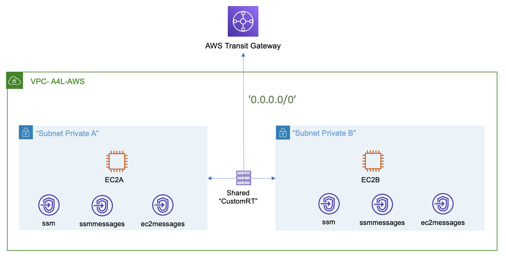

# Private VPC with TGW

Created to provision the needed infrastructure for Cantrill's [Advanced Demo Site-to-Site VPN] of the course **AWS Certified Solutions Architect - Professional**.

## Infrastructure

Figure 1: Baseline infrastructure

1. A vpc named "A4L-AWS"
2. Two isolated subnets.
3. An ec2 instance in each subnet
4. Vpc Interfaces endpoint to support SHH connection using SSM.
5. A shared Route Table (CustomRT) with a route that redirects all traffic '0.0.0.0/0' to a TGW.