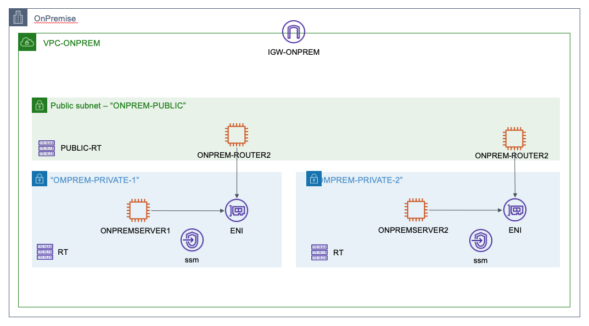

# Simulate an on-premise network in a AWS VPC

Created to provision the needed on-premise part of the infrastructure for Cantrill's [Advanced Demo Site-to-Site VPN] of the course **AWS Certified Solutions Architect - Professional**.

## Infrastructure

Figure 1: Baseline infrastructure

